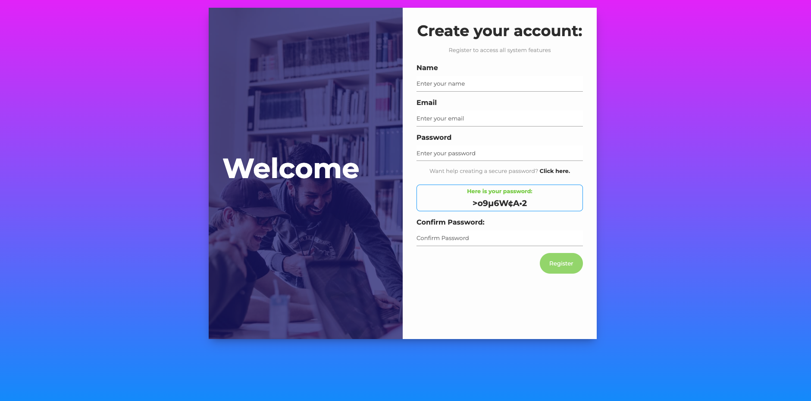

# Password Generator V01
 Description:

"Hello! I'm a passionate learner on a journey into the world of web development, currently exploring HTML, CSS, and JavaScript. As part of my learning experience, I've embarked on a project: the Password Generator.

This project is my initial foray into web programming, and it reflects my commitment to honing my coding skills. The Password Generator is a simple yet meaningful project that allows users to create strong and secure passwords effortlessly.

Throughout this project, I've utilized HTML for structuring the webpage, CSS for styling the user interface, and JavaScript for implementing the password generation functionality. While I'm new to programming, I'm proud of the progress I've made, and this project showcases my dedication to mastering these essential technologies.

Join me on my coding journey, and explore this Password Generator project to witness my early steps in web development. As I continue to learn and grow, I look forward to taking on more complex challenges and contributing to exciting web projects in the future."

 

